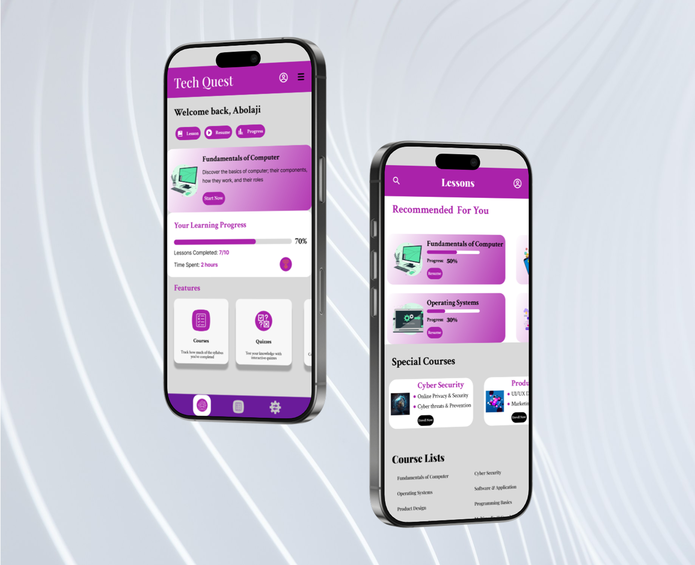

# 🎓 Final Year Project - UI/UX Design

## 📌 Project Overview  
This is the **UI/UX design** for my final year project, which focuses on [briefly describe your project topic].  
It is designed to be **user-friendly, responsive, and visually appealing**, ensuring seamless interaction.  

## 🎨 Design Details  
- **Tool Used:** Figma  
- **Design Type:** Web Application UI  
- **Focus Area:** [E.g., Dashboard, User Login, etc.]  
- **Responsive:** [Yes/No]  

## 🖼 Preview  
Here’s a preview of the UI design:  
  

## 🔗 View Full Design  
Click below to explore the complete Figma design:  
👉 [View Figma Design](https://www.figma.com/proto/yiwUZYPok0iy5DNX4nBkfw/Final-Year-Project?page-id=0%3A1&node-id=1-2&p=f&viewport=184%2C270%2C0.3&t=fwNiXwccuefIXf2k-1&scaling=scale-down&content-scaling=fixed&starting-point-node-id=1%3A2)  

## 🚀 Live Prototype (If Available)  
If there’s a live prototype or frontend development, you can check it out here:  
👉 [GitHub Repository for frontend](https://akbolaji-04.github.io/Techquest/e)  

## 💡 Key Features  
- [Feature 1] (e.g., Modern and clean UI design)  
- [Feature 2] (e.g., Interactive dashboard for better user experience)  
- [Feature 3] (e.g., Responsive layout for both mobile and desktop)  

---
