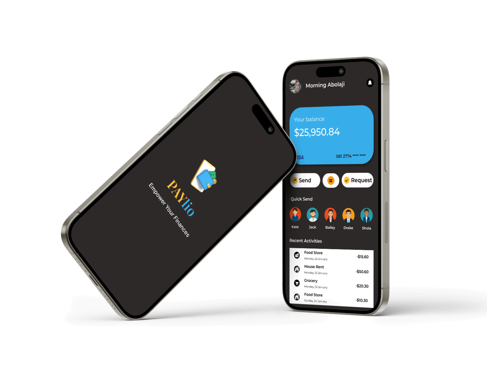

# 💳 PayLio - Finance App UI/UX

## 📌 Project Overview  
PayLio is a **modern finance app** designed to simplify **money management, transactions, and expense tracking**. The **UI/UX design** focuses on **user-friendliness, accessibility, and a visually appealing interface** for seamless financial operations.  

The project is **UI-focused**, with no functionality implemented yet. The design ensures a **dark-themed interface** for better readability and usability.  

## 🎨 Design Details  
- **Tool Used:** Figma  
- **Platform:** Mobile App (iOS & Android)  
- **Features:**  
  - 💰 **Account Balance Overview**  
  - 📤 **Send & Request Money**  
  - 📊 **Recent Transactions & Quick Send Feature**  

## 🖼 Preview  
Here’s a preview of the UI design:  
  

## 🔗 View Full Design  
👉 [View Figma Design](https://www.figma.com/design/THylV8fXVVsgjrgOGhgaYa/Day-2?node-id=0-1&t=PaVqWZR9ctU1o5nu-1)  

---

